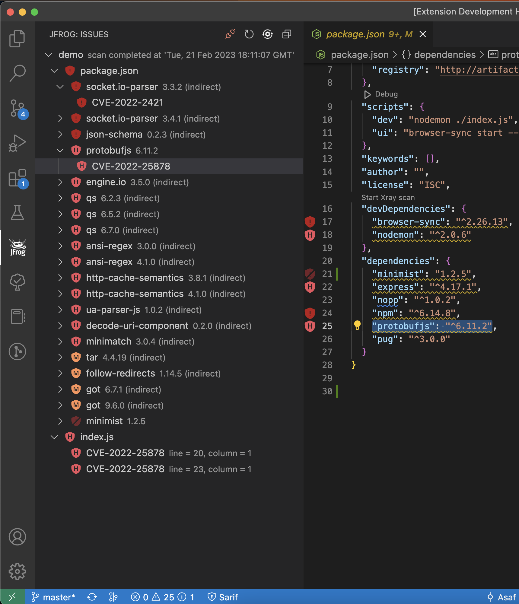
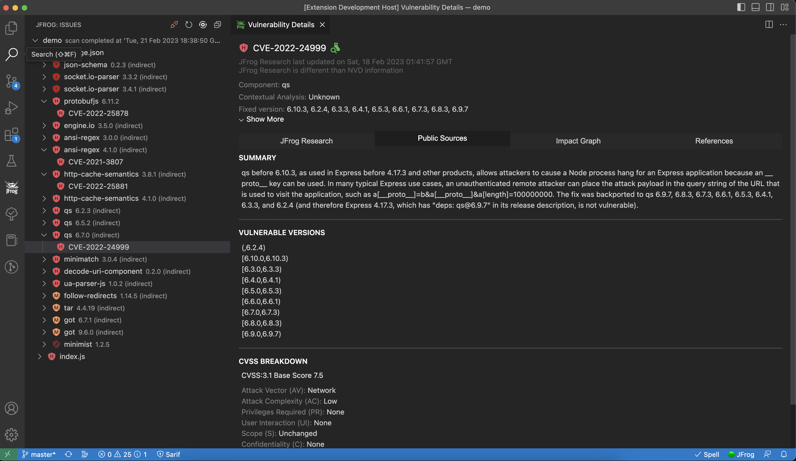
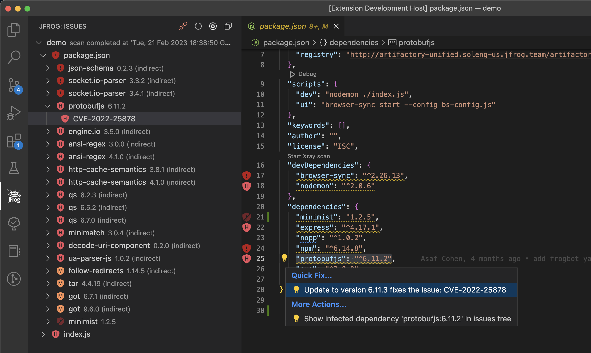
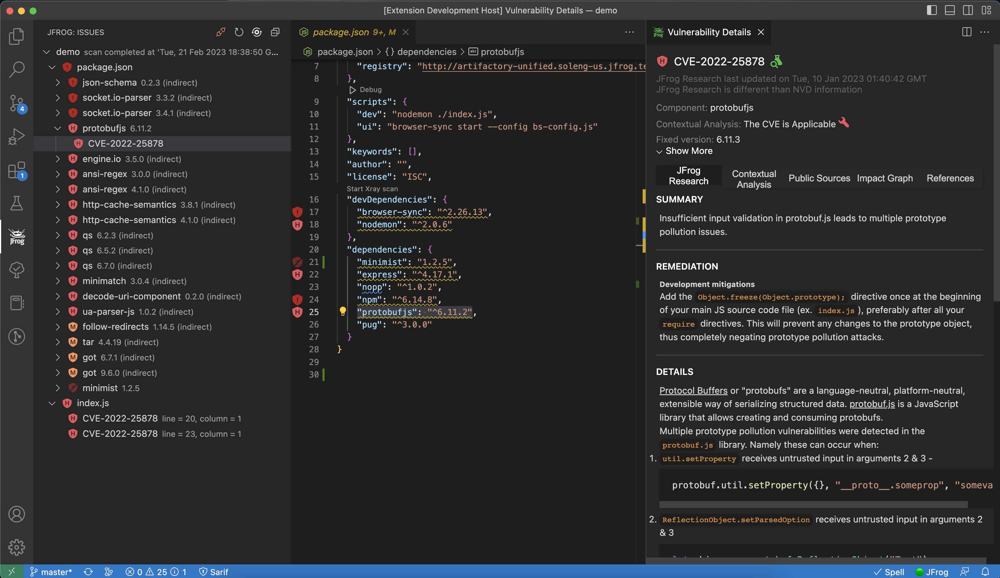
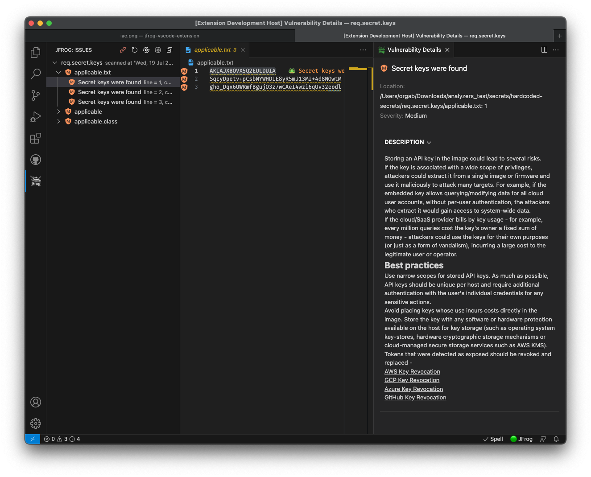
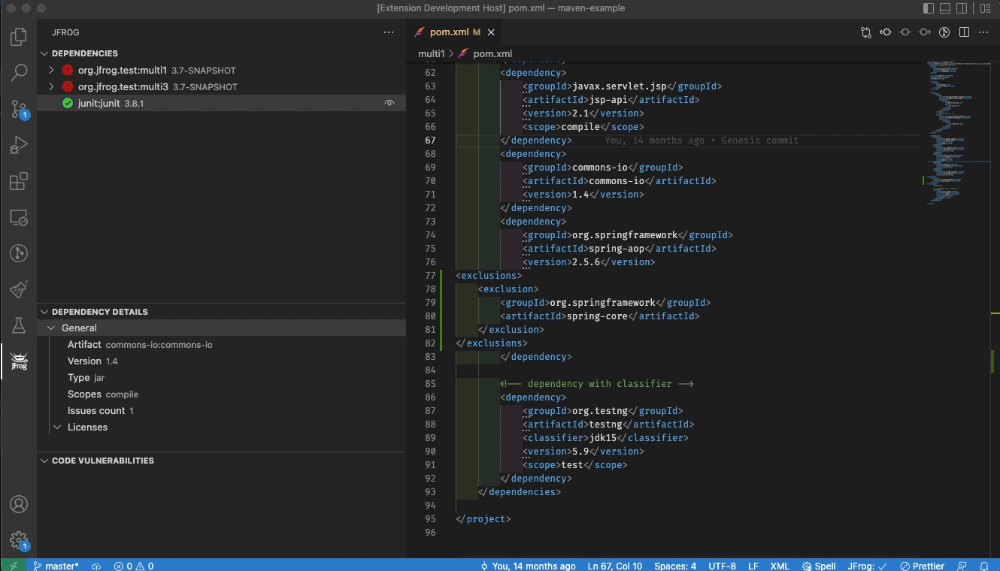

# Using the JFrog Extension in VS Code

The extension offers two modes, **Local** and **CI**. The two modes can be toggled by pressing on their respective buttons that will appear next to the components tree.

* The **Local** view displays information about the local code as it is being developed in VS Code. The developer can scan their local workspace continuously. The information is displayed in the **Local** view.
* The **CI** view allows the tracking of the code as it is built, tested and scanned by the CI server. It displays information about the status of the build and includes a link to the build log on the CI server.

#### Severity Icons

The icon demonstrates the top severity issue of a selected component and its transitive dependencies. The following table describes the severities from highest to lowest:

| Icon                                                                                                                                                                                                                                                                    | Severity       | Description                                          |
| ----------------------------------------------------------------------------------------------------------------------------------------------------------------------------------------------------------------------------------------------------------------------- | -------------- | ---------------------------------------------------- |
|                                                                                                                                                                                                                               | Critical       | Issue with critical severity                         |
|                                                                                                                                                                                                                                   | High           | Issue with high severity                             |
|                                                                                                                                                                                                                                 | Medium         | Issue with medium severity                           |
|                                                                                                                                                                                                                                    | Low            | Issue with low severity                              |
|                                                                                                                                                                                                                                | Unknown        | Issue with unknown severity                          |
|  | Not Applicable | CVE issue that is not applicable to your source code |
|                                                                                                                                                                                                                                 | Normal         | No issues (Used only in CI view)                     |

## The Local View

### General

The JFrog VS Code Extension enables continuous scans of your project with the JFrog Platform. The security related information will be displayed under the Local view.
It allows developers to view vulnerability information about their dependencies and source code in their IDE.
With this information, you can make an informed decision on whether to use a component or not before it gets entrenched into the organization’s product.

scan your workspace by clicking the Scan/Rescan button, the  icon at the extension tab or click on Start Xray Scan from within the editor. The scan will create a list of files with vulnerabilities in the workspace.

### Software Composition Analysis (SCA)

Each descriptor file (like pom.xml in Maven, go.mod in Go, etc.) displayed in the JFrog Panel contains vulnerable dependencies, and each dependency contains the vulnerabilities themselves.

Each file node in the tree is interactive. Click and expand it to view its children node and navigate to the corresponding file in the IDE editor for better visibility. Upon navigating to a file, the extension will highlight the vulnerable line, making it easier to locate the specific issue

In addition the locations with vulnerabilities will be marked in the editor. By clicking on the light bulb icon next to a vulnerable location in the editor, you can instantly jump to the corresponding entry in the tree view.

Clicking on a CVE in the list will open the location with the issue in the editor and a vulnerability details view. This view contains information about the vulnerability, the vulnerable component, fixed versions, impact paths and much more.

Update a vulnerable direct dependency to a fixed version directly from the vulnerable location at the editor using quick fix

When Xray watches are enabled and a vulnerability is detected, a closed eye icon will appear next to the vulnerability line in the JFrog extension. By clicking on this icon, you can initiate the process of creating an [Ignore Rule](https://www.jfrog.com/confluence/display/JFROG/Ignore+Rules) in Xray.

### CVE Research and Enrichment

For selected security issues, get leverage-enhanced CVE data that is provided by our JFrog Security Research team. Prioritize the CVEs based on:

* JFrog Severity: The severity given by the JFrog Security Research team after the manual analysis of the CVE by the team. CVEs with the highest JFrog security severity are the most likely to be used by real-world attackers. This means that you should put effort into fixing them as soon as possible.
* Research Summary: The summary that is based on JFrog's security analysis of the security issue provides detailed technical information on the specific conditions for the CVE to be applicable.
Remediation: Detailed fix and mitigation options for the CVEs

Check out what our research team is up to and stay updated on newly discovered issues by clicking on this [link](https://research.jfrog.com).

### Vulnerability Contextual Analysis
>
> **_NOTE:_**  Vulnerability Contextual Analysis requires Xray version 3.66.5 or above and Enterprise X / Enterprise+ subscription with Advanced DevSecOps.

Xray automatically validates some high and very high impact vulnerabilities, such as vulnerabilities that have prerequisites for exploitations, and provides contextual analysis information for these vulnerabilities, to assist you in figuring out which vulnerabilities need to be fixed. Vulnerability Contextual Analysis data includes:

* Vulnerability Contextual Analysis status: Vulnerability Contextual Analysis results indicating if a CVE was found applicable in your application or not applicable.
* Vulnerability Contextual Analysis breakdown: An explanation provided by our research team as to why the CVE was found applicable or not applicable.
* Remediation: Contextual mitigation steps and options provided by our research team that assist you with remediating the issues.

### Secrets Detection
>
> **_NOTE:_**  Secrets Detection requires Xray version 3.66.5 or above and Enterprise X / Enterprise+ subscription with Advanced DevSecOps.

Detect any secrets left exposed inside the code. to prevent any accidental leak of internal tokens or credentials. To ignore detected secrets, you can add a comment which includes the phrase _jfrog-ignore_ above the line with the secret.

### Infrastructure as Code (IaC) Scan
>
> **_NOTE:_**  Infrastructure as Code (IaC) requires Xray version 3.66.5 or above and Enterprise X / Enterprise+ subscription with Advanced DevSecOps.

Scan Infrastructure as Code (Terraform) files for early detection of cloud and infrastructure misconfigurations.

## The CI View

The CI view of the extension allows you to view information about your builds directly from your CI system. This allows developers to keep track of the status of their code, while it is being built, tested and scanned as part of the CI pipeline, regardless of the CI provider used.

This information can be viewed inside JFrog VS Code Extension, from the JFrog Panel, after switching to CI mode.

The following details can be made available in the CI view.

* Status of the build run (passed or failed)
* Build run start time
* Git branch and latest commit message
* Link to the CI run log
* Security information about the build artifacts and dependencies

### How Does It Work?

The CI information displayed in VS Code is pulled by the JFrog Extension directly from JFrog Artifactory. This information is stored in Artifactory as part of the build-info, which is published to Artifactory by the CI server.

Read more about build-info in the [Build Integration](https://www.jfrog.com/confluence/display/JFROG/Build+Integration) documentation page. If the CI pipeline is also configured to scan the build-info by JFrog Xray, the JFrog VS Code Extension will pull the results of the scan from JFrog Xray and display them in the CI view as well.

### Setting Up Your CI Pipeline

Before VS Code can display information from your CI in the CI View, your CI pipeline needs to be configured to expose this data.
Read [this guide](https://www.jfrog.com/confluence/display/JFROG/Setting+Up+CI+Integration) which describes how to configure your CI pipeline.

### Setting Up the CI View

Set your CI build name in the Build name pattern field at the [Extension Settings](#extension-settings). This is the name of the build published to Artifactory by your CI pipeline. You have the option of setting \* to view all the builds published to Artifactory.

After your builds were fetched from Artifactory, press on the Builds  button to choose what build to display.

